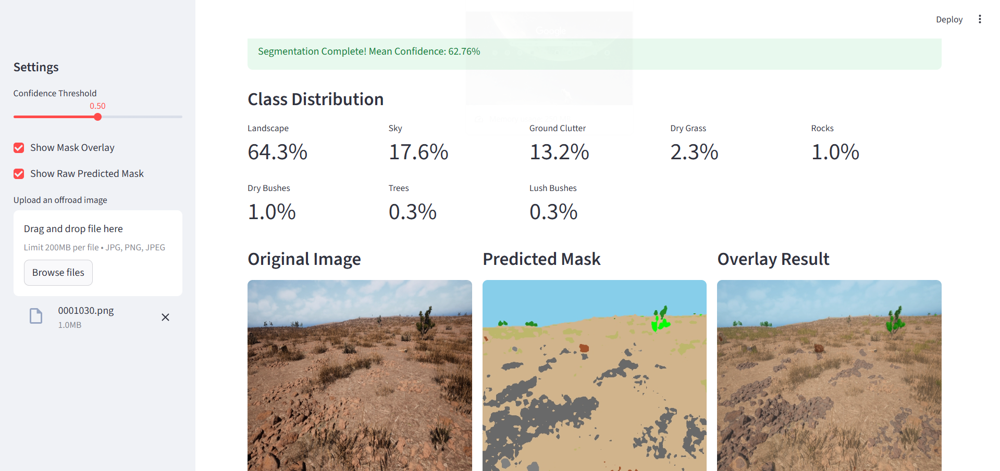
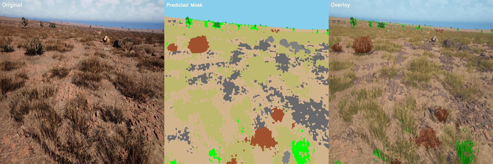
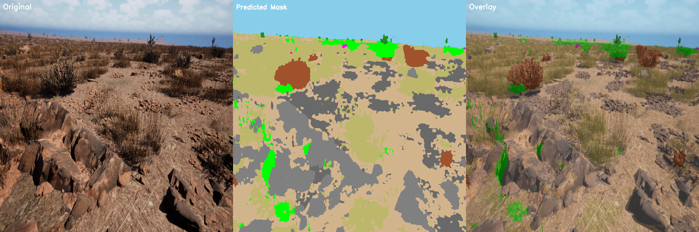
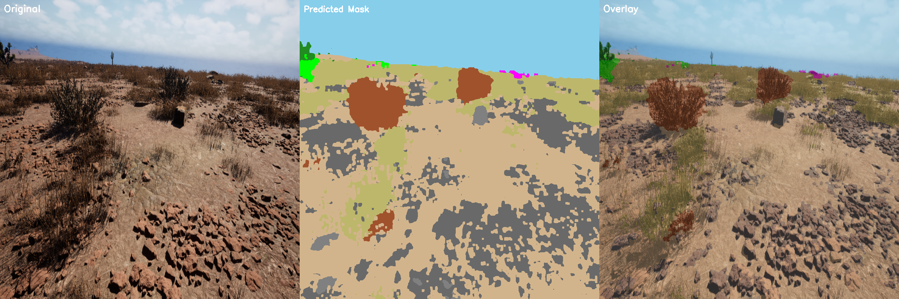

# Off-Road Terrain Semantic Segmentation

> A production-grade semantic segmentation pipeline for autonomous off-road perception using **DeepLabV3+** with a **ResNet101** backbone. Achieves **33.3% mIoU** and **43.2% Dice** across 10 terrain classes under extreme class imbalance.


---

## Interactive Dashboard

A Streamlit-powered dashboard for real-time inference and visualization:



```bash
streamlit run app.py
```

**Features:**
- Upload off-road images for instant segmentation
- Adjustable confidence threshold slider (0.0 – 1.0)
- Real-time visualization: Original → Predicted Mask → Overlay
- Per-class distribution statistics with color-coded legend

---

## Segmentation Results

| Original Image | Predicted Mask | Overlay |
|:-:|:-:|:-:|
|  | | |
|  | | |
|  | | |

> Each image above shows the **Original → Predicted Mask → Overlay** side-by-side.

---

## Architecture

### Model: DeepLabV3+

```
┌──────────────────────────────────────────────────────────┐
│                    DeepLabV3+ Architecture                │
│                                                          │
│  Input (512×512×3)                                       │
│      │                                                   │
│      ▼                                                   │
│  ┌──────────────────┐                                    │
│  │  ResNet101        │  ← ImageNet Pretrained Encoder    │
│  │  (Backbone)       │     LR = 1e-5 (frozen first 5ep) │
│  └──────────────────┘                                    │
│      │                                                   │
│      ▼                                                   │
│  ┌──────────────────┐                                    │
│  │  ASPP Module      │  ← Multi-scale Feature Extraction │
│  │  (Atrous Spatial  │     Dilation rates: 6, 12, 18     │
│  │   Pyramid Pooling)│                                   │
│  └──────────────────┘                                    │
│      │                                                   │
│      ▼                                                   │
│  ┌──────────────────┐                                    │
│  │  Decoder Head     │  ← LR = 5e-4 (5× encoder rate)   │
│  └──────────────────┘                                    │
│      │                                                   │
│      ▼                                                   │
│  Output (512×512×10) → Per-pixel class prediction        │
└──────────────────────────────────────────────────────────┘
```

Built using [`segmentation-models-pytorch`](https://github.com/qubvel/segmentation_models_pytorch):

```python
model = smp.DeepLabV3Plus(
    encoder_name="resnet101",
    encoder_weights="imagenet",
    in_channels=3,
    classes=10,          # 10 terrain classes
    activation=None      # Raw logits for loss computation
)
```

---

## Loss Functions

We use a **4-component Combined Loss** designed to tackle extreme class imbalance:

### `CombinedLoss = CE + Tversky + Focal + OHEM`

| Loss Function | Purpose | Key Parameters |
|:---|:---|:---|
| **Weighted CrossEntropy** | Base pixel-wise classification | Rare classes weighted **100×** vs majority classes at 1× |
| **Tversky Loss** | Penalizes False Negatives (missed rare classes) | `α=0.9`, `β=0.1` — 9× penalty for FN over FP |
| **Focal Loss** | Down-weights easy pixels, focuses on hard boundaries | `γ=2` — exponentially reduces easy-pixel contribution |
| **OHEM Loss** | Online Hard Example Mining — trains on hardest pixels only | `top_k=0.1` — only the top 10% hardest pixels contribute |

### Class Weight Distribution

```
Trees:          100.0   ←─ Rare (boosted)
Lush Bushes:    100.0   ←─ Rare
Dry Grass:        1.0   ←─ Dominant (down-weighted)
Dry Bushes:     100.0   ←─ Rare
Ground Clutter: 100.0   ←─ Rare
Flowers:        100.0   ←─ Very Rare
Logs:           100.0   ←─ Very Rare
Rocks:          100.0   ←─ Rare
Landscape:        1.0   ←─ Dominant (down-weighted)
Sky:              1.0   ←─ Dominant (down-weighted)
```

---

## Evaluation Metrics

Two primary metrics are tracked in real-time during training:

### Dice Score (F1)
Measures the overlap between prediction and ground truth as a harmonic mean:

```
Dice = 2 × |Prediction ∩ Ground Truth| / (|Prediction| + |Ground Truth|)
```

### IoU (Intersection over Union / Jaccard Index)
The standard segmentation metric — stricter than Dice:

```
IoU = |Prediction ∩ Ground Truth| / |Prediction ∪ Ground Truth|
```

### Results Summary

| Metric | Baseline | Final (Optimized) | Improvement |
|:---|:---|:---|:---|
| **Val mIoU** | 0.1000 | **0.3326** | **+232%** |
| **Val Dice** | 0.1000 | **0.4322** | **+332%** |
| **Train Dice** | 0.1000 | **0.6582** | **+558%** |

### Per-Class Performance

| Class | Dice Score | Presence in Dataset |
|:---|:---|:---|
| Sky | ~78% | 100% of images |
| Dry Grass | ~65% | 100% of images |
| Landscape | ~62% | 100% of images |
| Trees | ~48% | 98% of images |
| Rocks | ~20% | 100% of images |
| Lush Bushes | ~15% | 100% of images |
| Flowers | ~5% | 26% of images |
| Logs | ~3% | 6% of images |

---

## Dataset: 10 Terrain Classes

The dataset uses **uint16 segmentation masks** with the following pixel-value → class mapping:

| Pixel Value | Class ID | Class Name | Color (RGB) |
|:---:|:---:|:---|:---|
| 100 | 0 | Trees | `(34, 139, 34)` |
| 200 | 1 | Lush Bushes | `(0, 255, 0)` |
| 300 | 2 | Dry Grass | `(189, 183, 107)` |
| 500 | 3 | Dry Bushes | `(160, 82, 45)` |
| 550 | 4 | Ground Clutter | `(105, 105, 105)` |
| 600 | 5 | Flowers | `(255, 0, 255)` |
| 700 | 6 | Logs | `(139, 69, 19)` |
| 800 | 7 | Rocks | `(128, 128, 128)` |
| 7100 | 8 | Landscape | `(210, 180, 140)` |
| 10000 | 9 | Sky | `(135, 206, 235)` |

### Data Structure

```
data/
├── train/
│   ├── Color_Images/     # RGB training images (.png)
│   └── Segmentation/     # uint16 segmentation masks (.png)
├── val/
│   ├── Color_Images/
│   └── Segmentation/
└── testImages/
    └── Color_Images/     # Test images for inference
```

> Dataset is not included due to GitHub size limits. Place your data following the structure above.

---

## Training Pipeline

### Key Optimizations

| Feature | Implementation |
|:---|:---|
| **Mixed Precision (AMP)** | `torch.amp.autocast` + `GradScaler` for 2× speedup |
| **Differential Learning Rates** | Encoder: `1e-5`, Decoder: `5e-4` — protects pretrained features |
| **Weighted Sampling** | `WeightedRandomSampler` oversamples images with rare classes |
| **Checkpoint Resume** | Auto-loads `best_model_optimized.pth` to continue training |
| **Early Stopping** | Patience=15 epochs on Val Dice — prevents overfitting |
| **LR Scheduling** | `ReduceLROnPlateau` — halves LR after 7 epochs of no improvement |
| **cuDNN Benchmark** | `torch.backends.cudnn.benchmark = True` for GPU optimization |

### Data Augmentation (Albumentations)

```python
A.Compose([
    A.HorizontalFlip(p=0.5),
    A.RandomRotate90(p=0.5),
    A.OneOf([
        A.HueSaturationValue(p=1.0),
        A.RandomBrightnessContrast(p=1.0),
    ], p=0.5),
    A.ShiftScaleRotate(shift_limit=0.1, scale_limit=0.2, rotate_limit=15, p=0.5),
    A.CoarseDropout(num_holes_range=(1, 4), hole_height_range=(32, 64),
                    hole_width_range=(32, 64), p=0.3),
    A.Resize(512, 512),
])
```

### Training Configuration

```python
IMG_SIZE      = 512
BATCH_SIZE    = 8
EPOCHS        = 100
LR_ENCODER    = 1e-5
LR_DECODER    = 5e-4
WEIGHT_DECAY  = 1e-4
OPTIMIZER     = AdamW
NUM_WORKERS   = 4
```

---

## Critical Bug Fix: uint16 Mask Loading

The primary cause of the initial 10% IoU plateau was a **bit-depth corruption bug**.

**Problem:** Ground-truth masks are stored as `uint16` (pixel values up to 10000 for Sky). The standard `cv2.imread(path, 0)` truncates to `uint8`, clamping all labels > 255 to 255 — effectively merging Sky, Landscape, and other high-value classes.

**Fix:**
```diff
- mask = cv2.imread(self.masks[idx], 0)           # Truncates to uint8
+ mask = cv2.imread(self.masks[idx], cv2.IMREAD_UNCHANGED)  # Preserves uint16
```

**Impact:** IoU jumped from **10% → 25%** immediately after this fix.

---

## Project Structure

```
offroad_segmentation/
│
├── train.py                    # Main training script (AMP, differential LR, OHEM)
├── train_stable.py             # Alternative stable training variant
├── inference.py                # Batch visualization on test images
├── evaluate.py                 # Quantitative evaluation (Mean Dice/IoU)
├── app.py                      # Streamlit interactive dashboard
├── metrics.py                  # Dice Score & IoU computation
├── early_stopping.py           # Early stopping callback
│
├── models/
│   └── deeplabv3plus.py        # DeepLabV3+ with ResNet101 backbone
│
├── losses/
│   └── losses.py               # TverskyLoss, FocalLoss, OHEMLoss, CombinedLoss
│
├── dataset/
│   └── dataset.py              # Custom Dataset with uint16 mask support & augmentation
│
├── compute_sample_weights.py   # Weighted sampling for rare classes
├── compute_weights.py          # Inverse-frequency class weight calculation
│
├── diagnose_density.py         # Rare-class pixel density analysis
├── diagnose_distribution.py    # Per-class presence across dataset
├── diagnose_predictions.py     # Inference output class distribution
│
├── check_leakage.py            # Train/Val data leakage verification
├── organize_data.py            # Dataset directory setup utility
├── setup_env.ps1               # PowerShell environment setup script
│
├── assets/
│   └── dashboard.png           # Dashboard screenshot
│
├── checkpoints/                # Saved model weights (.pth)
├── performance_report.md       # Detailed evaluation report
├── requirements.txt            # Python dependencies
└── README.md                   # This file
```

---

## Quick Start

### 1. Environment Setup

```bash
# Python 3.10 required
python -m venv venv
.\venv\Scripts\activate        # Windows
source venv/bin/activate       # Linux/Mac

pip install -r requirements.txt
```

### 2. Prepare Dataset

Place your data following the structure in the [Dataset section](#-dataset-10-terrain-classes).

### 3. Train the Model

```bash
python train.py
```

- Automatically resumes from `checkpoints/best_model_optimized.pth` if available
- Saves best model based on Validation Dice Score
- Logs: Train Loss, Val IoU, Val Dice per epoch

### 4. Run Inference

```bash
python inference.py
```

Generates side-by-side visualizations: **Original | Mask | Overlay** in `inference_results/`

### 5. Evaluate Metrics

```bash
python evaluate.py
```

### 6. Launch Dashboard

```bash
streamlit run app.py
```

---

## Requirements

```
torch
torchvision
torchaudio
segmentation-models-pytorch
albumentations
opencv-python
matplotlib
tqdm
scikit-learn
pillow
tensorboard
timm
pyyaml
streamlit
```

---

## Training History

```
Epoch  1 | Train Loss: 4.2858 | Val IoU: 0.2248 | Val Dice: 0.2981  Saved
Epoch  2 | Train Loss: 3.6891 | Val IoU: 0.2418 | Val Dice: 0.3186  Saved
Epoch  3 | Train Loss: 3.5070 | Val IoU: 0.2552 | Val Dice: 0.3357  Saved
  ...
Epoch 50 | Train Loss: 2.5948 | Val IoU: 0.3326 | Val Dice: 0.4322
```

---

## Future Improvements

- **Higher Resolution**: Scale to 768×768 or 1024×1024 for finer boundary detection
- **Pseudo-Labeling**: Use high-confidence predictions on unlabeled data
- **Test-Time Augmentation (TTA)**: Multi-scale inference for robustness
- **Boundary Loss**: Add explicit boundary-aware loss for sharper edges
- **Architecture Upgrade**: Experiment with SegFormer or HRNet backbones

---

## Author

**Taniya**

---

## License

This project is licensed under the MIT License.
